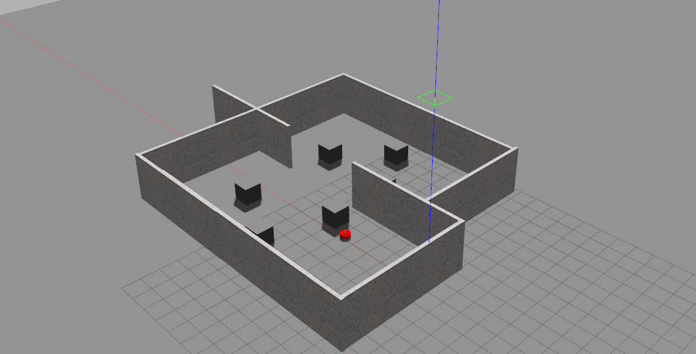

# 🤖 Navegação Autônoma com Q-Learning e Fast LiDAR

Este repositório foi desenvolvido como parte da entrega do **Projeto 1 da disciplina de Robôs Móveis Autônomos**, pelos alunos **Felipe Pereira Furlaneto** e **Marcos Vinicios dos Santos**.

## 🎯 Objetivo

Este projeto tem como objetivo desenvolver um sistema de navegação autônoma para um robô movel DC, desenvolvido pelo **Laboratório de Robótica e Sistemas Inteligentes da Universidade Federal de São Carlos** por meio da integração de técnicas de aprendizado por reforço (Q-learning) e percepção baseada em Fast LiDAR. 
A proposta consiste em treinar um agente em um ambiente simulado, controlado e simplificado, utilizando dados discretizados sensoriais do modole simulado LiDAR Velodyne HDL-32E,desenvolvido por **X**, disponivel em: , bem como neste repositório na pasta velodyne simulator. Esse sensor, será resposavel pela identificação dos obstaculos e por consequência na tomada de decisão em tempo real.
Ao final, como trabalho futuro busca-se avaliar a capacidade do agente de generalizar o comportamento aprendido para cenários distintos, mesmo diante de incertezas e mudanças no ambiente.

---

## 📥 Como Baixar e Executar o Projeto
## 1. Clonar o Repositório
```bash
cd seu workspace/src
git clone https://github.com/FelipePF22/Qlearn-AutoDrive.git
```
---

## 2. Compilar os arquivos
```bash
cd
catkin clean
catkin build
source devel/setup.bash
```
---
## 3. Rodar a simulação
```bash
roslaunch q_learning_control q_learning_sim.launch
```

## 📷 Imagens da Simulação
Após rodar o código de cima, as seguinte telas serão abertas

**Ambiente no Gazebo:**



**Visualização no RViz:**


---

> ⚠️ Este repositório contém os **resultados preliminares da primeira parte da avaliação**
> Dessa forma, o diretorio contem apenas o seguimento de treinamento inicial, as tecnicas de otimização de aprendizagem de maquinas, bem como a implementação da politica em um ambiente mais complexo, se destinaram para a segunda fase do projeto. 
