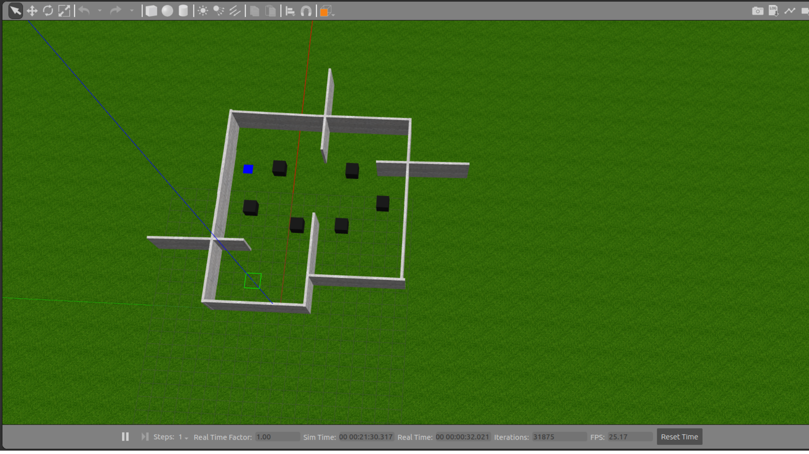

# 🤖 Projeto de Aprendizado por Reforço Profundo

Este repositório foi desenvolvido como parte da entrega do **Projeto 2 da disciplina de Robôs Móveis Autônomos**, pelos alunos **Felipe Pereira Furlaneto** e **Marcos Vinicios dos Santos**.


## 📌 Descrição do Projeto

Este repositório apresenta um estudo sobre Aprendizagem por Reforço Profundo (Deep Reinforcement Learning – DRL), com ênfase na aplicação do algoritmo Deep Q-Network (DQN) em um cenário de navegação autônoma. A aprendizagem por reforço profundo permite que agentes tomem decisões baseadas em interações com o ambiente, utilizando redes neurais profundas para aproximar funções de valor e lidar com espaços de estados de alta dimensionalidade.

Um dos principais desafios em DRL está na definição adequada dos hiperparâmetros, que exercem influência direta na eficiência, estabilidade e convergência do processo de aprendizado. Dentre eles, o parâmetro epsilon, responsável por controlar o equilíbrio entre exploração (explore) e exploração do conhecimento já adquirido (exploit) na estratégia ε-greedy, possui papel central. Variações em sua taxa de decaimento ou valor inicial podem afetar de forma significativa o desempenho final do agente.

O objetivo deste projeto é investigar a influência do parâmetro epsilon durante o treinamento de um agente DQN, bem como sua aplicação em uma tarefa simulada de navegação autônoma. A proposta busca contribuir para uma compreensão mais aprofundada do impacto desse hiperparâmetro no processo de aprendizado e na tomada de decisão do agente.

---

## 🤖 Descrição do Robô
O robô simulado neste projeto foi desenvolvido a partir de um modelo originalmente disponibilizado nos arquivos da disciplina de RMA 2025 (Robos Móveis Autônomos). Esse modelo foi exportado do SolidWorks para o formato URDF e adaptado para testes em ambientes virtuais no simulador Gazebo. Trata-se de uma plataforma com base circular e duas rodas laterais acionadas por um sistema de locomoção diferencial.

A estrutura do robô inclui ainda um LIDAR 3D Velodyne HDL-32E, com 32 feixes de laser e resolução configurável, ideal para mapeamento e detecção de obstáculos em 360°

Essa estrutura pode ser observada abaixo:

<!-- Insira aqui uma imagem do robô -->


---

## 🌐 Ambiente Simulado
O ambiente virtual utilizado nos experimentos foi desenvolvido no simulador Gazebo 11 e representa um cenário interno composto por múltiplos obstáculos e paredes delimitadoras, conforme ilustrado na imagem abaixo. A superfície principal consiste em um terreno plano com textura de gramado (ground_plane), sobre o qual foi construído um espaço com paredes verticais que formam corredores e compartimentos interligados, simulando uma planta arquitetônica simples com dimensões de 15 metros de largura por 15 metros de comprimento.

Dentro do ambiente, foram posicionados obstáculos cúbicos pretos em diferentes locais, com o objetivo de aumentar a complexidade da navegação e demandar do agente autônomo habilidades de desvio e planejamento de trajetória até o ponto final, destacado pelo quadro azul. O layout foi projetado para incluir áreas estreitas, bifurcações, espaços abertos e uma zona de chegada, desafiando tanto a estratégia de exploração quanto a política de decisão aprendida pelo agente.

<!-- Insira aqui uma imagem do ambiente no Gazebo -->


---

## ⚙️ Instalação e Execução

### 📥 Clonando o Repositório


```bash
cd  seu_workspace/src
git clone https://github.com/FelipePF22/Deep-Qlearn-AutoDrive.git
catkin build
source devel/setup.bash
```

### ⚠️ Aviso: Nesse projeto o nome do workspace esta como ros_ws, portanto antes de executar os launchs verifique o código em python do respectivo launch para alterar o endereço onde será salvo os logs e a rede treinada

---

## 🖥️ Launch files

---

## 🔄 Treinamento do sistema: 

```bash
roslaunch q_learning_control q_learning_sim.launch
```

---

### ⚠️ Aviso: O repositório contem três treinamentos para três épsilons, dessa forma, afim de validar corretamente o treinamento, basta substituir o arquivo q_net.pth da pasta "network" pelo q_net.pth do respectivo resultado que deseja, ou seja, épsilon = 1  ou épsilon = 0.6 

### 🔴 Nota: Originalmente o arquivo network já contem o q_net.pth do épsilon = 1.0
---

## 🔍 Validação do treinamento: 
```bash
roslaunch q_learning_control q_learning_validation.launch
```
---


